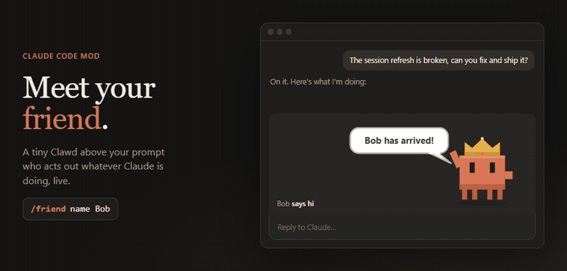
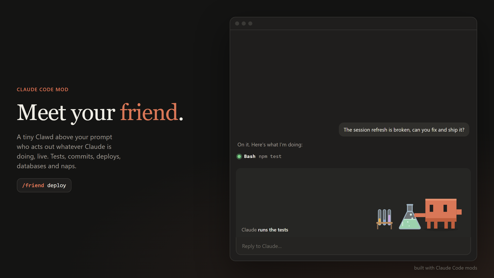
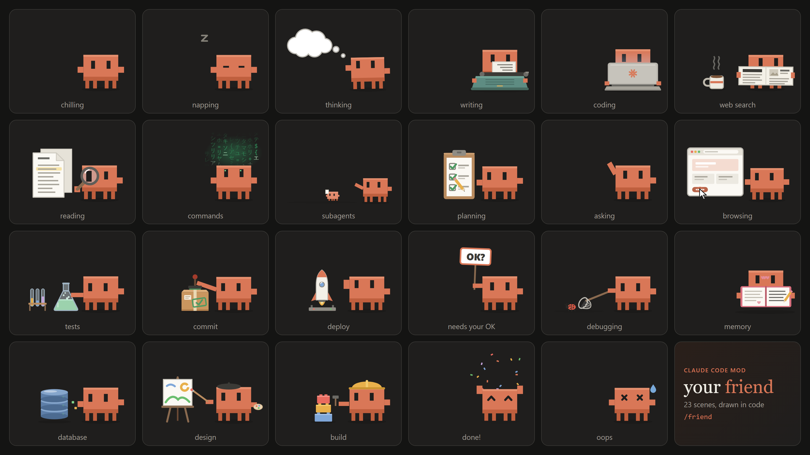
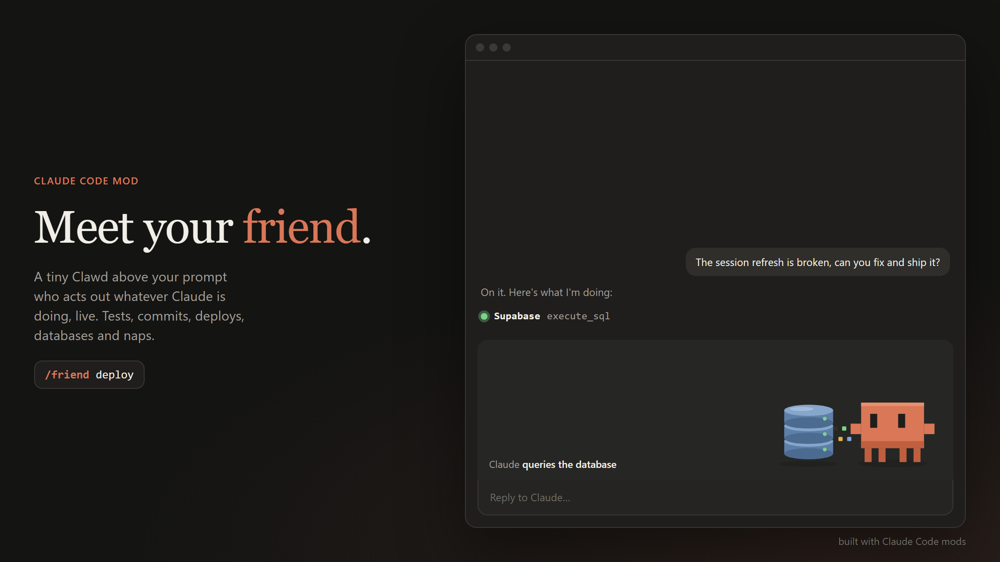

# Claude Friend

A tiny Clawd who lives above your prompt in [Claude Code](https://claude.com/claude-code) and acts out whatever Claude is doing, live.



He taps away at a laptop while Claude codes, reads the newspaper during a web search, watches a flask bubble while your tests run, stamps a parcel on every commit, launches a rocket when you deploy, chases a bug with a net, and nods off when you go quiet.



## Install

In Claude Code, run:

```
/plugin marketplace add redemptionnn/clawd-friend
/plugin install clawd-friend
```

Then start a new session (or run `/reload-plugins`) and your friend shows up above the prompt.

Or from a shell:

```bash
claude plugin marketplace add redemptionnn/clawd-friend
```

```bash
claude plugin install clawd-friend
```

To update later:

```bash
claude plugin marketplace update clawd-friend
```

**Requirements:** Claude Code 2.1.286 or newer. Mods are an early-access Claude Code feature, so the API may change between releases. The full animated character is drawn in the Claude Code desktop app (and the VS Code extension); the terminal shows a compact text version.

## 23 scenes, one tiny friend



He picks a scene from what Claude is actually doing, as it happens:

| Scene | When |
| --- | --- |
| 💭 Thinking | Claude is thinking, or reading a tool's result before its next move |
| ⌨️ Writing | Claude is writing its reply, or editing `.md` / `.txt` docs (a typewriter that faces him) |
| 💻 Coding | Editing or writing code (a laptop, lid turned toward him) |
| 📰 Web search | `WebSearch`, `WebFetch` and search or docs MCP tools (he reads the paper with a coffee) |
| 🔍 Reading | `Read`, `Grep`, `Glob` (a magnifying glass over the docs) |
| ⚡ Commands | Any other shell command (green hacker glyphs rain above him) |
| 🧪 Tests | `npm test`, `pytest`, `vitest`, `jest`, `go test`, `cargo test`, ... |
| 📦 Commit | `git commit` |
| 🚀 Deploy | `git push`, `vercel`, `npm publish`, `npm run deploy`, deploy MCP tools |
| 🧱 Build | `npm run build`, `tsc`, `cargo build`, `docker build`, `make`, ... |
| 🗄️ Database | `psql`, `prisma migrate`, Supabase / SQL MCP tools, `.sql` files and migrations |
| 🐞 Debugging | `node --inspect`, `pdb`, `gdb`, debugging skills |
| 🎨 Design | `.css` / `.svg` / Tailwind config edits, Figma and design MCP tools |
| 📔 Memory | Writing `CLAUDE.md` or Claude's memory files |
| 🐾 Subagents | Claude sends out subagents (tiny Clawds march off with their tasks) |
| 📋 Planning | Todo and task list updates |
| 🌐 Browsing | Browser automation tools |
| 👋 Asking | Claude asks you a question |
| 🪧 Needs your OK | A tool call is waiting for your permission |
| 🎉 Done | A turn finished: he jumps, confetti flies |
| 💧 Oops | A turn ended on an error |
| 😌 Chilling | Nothing going on |
| 💤 Napping | Two quiet minutes in a row |



## Skins

Dress him up. A skin stays on through every scene and is remembered across sessions. When a scene brings its own hat (the hard hat while building, the beret while designing) that one wins for a moment, and he only holds an item while his hand is free.

| Hats | | Items in hand | |
| --- | --- | --- | --- |
| 👑 `/friend crown` | 🎩 `/friend tophat` | ☕ `/friend coffee` | 🪄 `/friend wand` |
| 🧙 `/friend wizard` | 🧢 `/friend beanie` | 🗡️ `/friend sword` | 🌸 `/friend flower` |
| 🤠 `/friend cowboy` | 🎧 `/friend headphones` | 🎈 `/friend balloon` | |
| ⚔️ `/friend viking` | 😇 `/friend halo` | | |
| 🥳 `/friend party` | 🎃 `/friend pumpkin` | | |

`/friend skins` shows them all in a gallery (click one to put it on), and `/friend noskin` takes it off.

## Give him a name

```
/friend name Bob
```

From then on he greets you with a little speech bubble, "Bob has arrived!", whenever you call him or start a session.

## Commands

Not sure what's there? `/friend menu` lists everything, with buttons in the desktop app.

| Command | What it does |
| --- | --- |
| `/friend` | Call your friend, or send him off if he's already here (remembered across sessions) |
| `/friend menu` | Every command, with buttons |
| `/friend skins` | The skin gallery; click one to wear it |
| `/friend <skin>` | Wear a skin, e.g. `/friend crown` or `/friend sword` |
| `/friend noskin` | Take the skin off |
| `/friend name <name>` | Give him a name (up to 16 characters) |
| `/friend scenes` | Every scene, with buttons to play them |
| `/friend <scene>` | Play any scene for a few seconds, e.g. `/friend deploy` or `/friend build` |
| `/friend pane` | Move him into a side pane |
| `/friend stage` | Put him back above the prompt |
| `/friend stats` | What he saw today: file edits, reads, commands, web lookups, helpers, finished turns |

## How it works

Claude Friend is a Claude Code mod: a plugin whose behaviour is a TypeScript module of function hooks.

- **What Claude is doing.** A `turn.step` hook watches the model's response as it streams: thinking, visible text, and the start of each tool call, whose arguments it reads as they arrive, so the scene changes before the tool even runs. A `tool.call` hook confirms the scene while the tool runs, and a `tool.check` hook notices when a call needs your permission.
- **Which scene.** [`plugin/hooks/classify.ts`](plugin/hooks/classify.ts) maps tool names, shell commands and file paths to scenes: `git commit` is a commit, `npm test` is tests, a `.css` edit is design, an MCP tool named `execute_sql` is the database.
- **Drawing.** A `ui.render` hook draws the band above the prompt. Every scene is an SVG built in code in [`plugin/hooks/scenes.ts`](plugin/hooks/scenes.ts), animated with CSS. There are no image files.
- **Cheap and private.** No model calls, no tokens, no network. Your daily stats stay on your machine in the plugin's own store.

## Develop

Clone the repo and load the plugin straight from disk; saving a file hot-reloads it.

```bash
git clone https://github.com/redemptionnn/clawd-friend.git
```

```bash
claude --plugin-dir ./clawd-friend/plugin
```

In the desktop app, where you can't pass flags, add the folder to the `env` block of `~/.claude/settings.json`:

```json
{
  "env": {
    "CLAUDE_CODE_PLUGIN_DIRS": "/absolute/path/to/clawd-friend/plugin"
  }
}
```

If you also installed it with `/plugin install`, disable that copy (`claude plugin disable clawd-friend`) so it doesn't load twice.

Check and test it against the engine:

```bash
claude plugin validate ./plugin
```

```bash
claude plugin test ./plugin
```

The tests in [`plugin/tests/scenes.test.ts`](plugin/tests/scenes.test.ts) run real tool calls through Claude Code's engine, draw the band while each call is in flight, and check that the right scene shows. [`plugin/tests/skins.test.ts`](plugin/tests/skins.test.ts) covers skins, names and the menu cards.

## Good to know

- The rounded panel behind the friend is drawn by Claude Code itself; a mod can't remove or recolor it.
- Claude Code doesn't tell a mod the moment you approve a permission prompt, so the "OK?" sign stays up until that tool call finishes.

## Layout

```
.claude-plugin/marketplace.json   lets /plugin find and install the plugin
plugin/
  .claude-plugin/plugin.json      name, version, metadata
  hooks/hooks.json                points at the hooks module
  hooks/register.tsx              the hooks: what Claude is doing, commands, drawing
  hooks/classify.ts               tool calls to scenes
  hooks/scenes.ts                 the 23 scenes, drawn as SVG in code
  hooks/skins.ts                  hats and items in hand
  types/index.d.ts                the plugin's state contract
  tests/                          claude plugin test
media/                            the demo GIF and screenshots
```

## License

[MIT](LICENSE)
